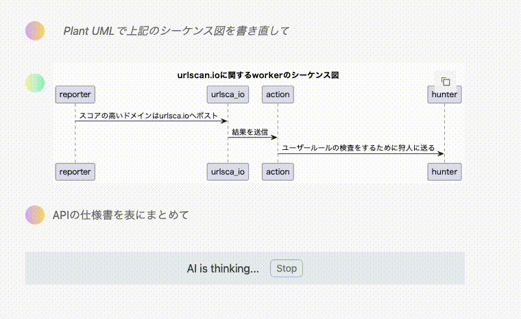

# chatbot sample

セルフホストなチャットボットを構築するサンプル  
ローカルPCに保存されたソースコードやドキュメントファイルを取り込むことができます。

[ChatGPTで社内用チャットボットを作った話](https://zenn.dev/tatsui/articles/langchain-chatbot)の記事で仕組みを紹介しています。

## Demo


## よくある疑問
* データ利用ポリシーについて
  * APIを経由して顧客から送られたデータ送られたデータは原則として学習に利用しない（学習のデータを共有してもいい、という場合はオプトイン）
  * 不正利用や誤った利用のモニタリングのためAPIデータを30日保持する（その後は削除。ただし法律で義務付けられている場合を除く）
  * 許可された限定的なOpenAIの従業員、専門の第三者請負業者は、不正使用の疑いを調査および検証する場合だけにこのデータにアクセスできる
  * 「ChatGPTやDALL-Eのような非APIのコンシューマサービスでのコンテンツ（入力プロンプトやその応答、アップロードした画像や生成した画像）はサービスの向上のために利用するかもしれない
  * 悪用の可能性が低いユースケースを展開する企業顧客であれば、APIデータを全く保存しないことを要求できる
* ChatGPTとChatGPT APIの違い
  * ChatGPT APIは、ChatGPTの機能を使いやすくしたもので、プログラマーが簡単にChatGPTを使うことができるようになります。
  * 本サンプルではChatGPT APIを利用します。
  * ChatGPT APIを利用するには、OpenAIのアカウントを作成し、APIキーを発行する必要があります。

## APIキーの設定
```
export OPENAI_API_KEY=<Open AI API Key>
```

## インストール
```
docker-compose up -d --build chatbot
```

## ベクトルデータベースの作成
```bash
docker-compose exec chatbot python /app/ingest.py --help
ingest.py [OPTIONS] TARGET
```
TARGET : 処理するファイルやディレクトリのパスを指定します。(必須項目)  
オプションには以下のものがあります。

* `-o, --output-file TEXT` : 出力ベクトルデータベースファイル名を指定します。
* `-l, --loader-cls [text|pdf_miner|pymupdf|pdf|html]` : 使用するローダークラスを指定します。デフォルトは text です。
* `-dl, --dir-loader-cls [directory|readthedocs]` : ディレクトリ用のローダークラスを指定します。デフォルトは directory です。
* `-e, --file-ext TEXT` : 処理するファイルの拡張子を指定します。
* `-cs, --chunk-size INTEGER` : テキストチャンクのサイズを指定します。デフォルトは 1000 です。
* `-co, --chunk-overlap INTEGER` : テキストチャンクのオーバーラップを指定します。デフォルトは 200 です。
* `-d, --dry-run` : ドキュメントをベクトルストアに実際に追加しない。

例えば、./samples/pdf ディレクトリにあるすべてのPDFファイルを処理して、データベースファイルを作成する場合は、以下のようにします。  
`-d`オプションをつける事でデータベース構築を行わずに消費されるトークン数と料金を確認することができます。

```bash
docker-compose exec chatbot python /app/ingest.py -e pdf -l pdf_miner -o /data/projectname -d /samples/pdf
load 654 documents
use 338462 token
price 0.0169231 USD
Dry run mode enabled. Exiting without adding documents to vectorstore.
```

## ChatBOTの起動
先ほど保存したデータベースファイルを環境変数に設定しチャットボットを起動します。  
チャットボットにはブラウザから「 http://localhost:3000 」へ接続して下さい。
```bash
docker-compose up -d
```

## コマンドラインからチャットボットを利用する
質問に答えられなかったり、チャットの履歴を使ってMarkdownで図を書く場合は  
「>」を入力してから質問することでChatGPTへの質問に切り替えることができます。
```bash
python chat-cli.py -f data/output
```

## 参考
* https://dev.classmethod.jp/articles/openai-data-usage-policy/
* https://github.com/ddiu8081/chatgpt-demo
* https://github.com/hwchase17/chat-langchain
